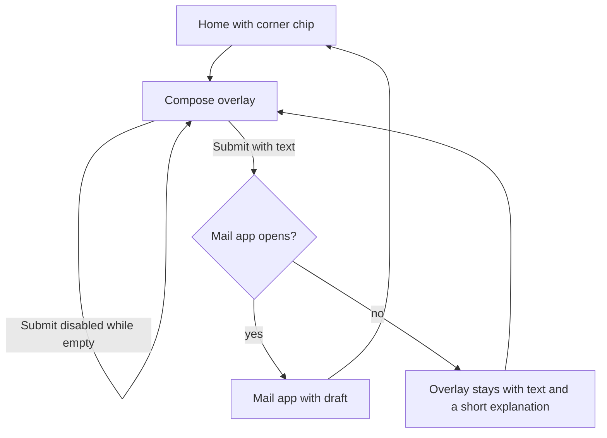
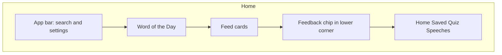
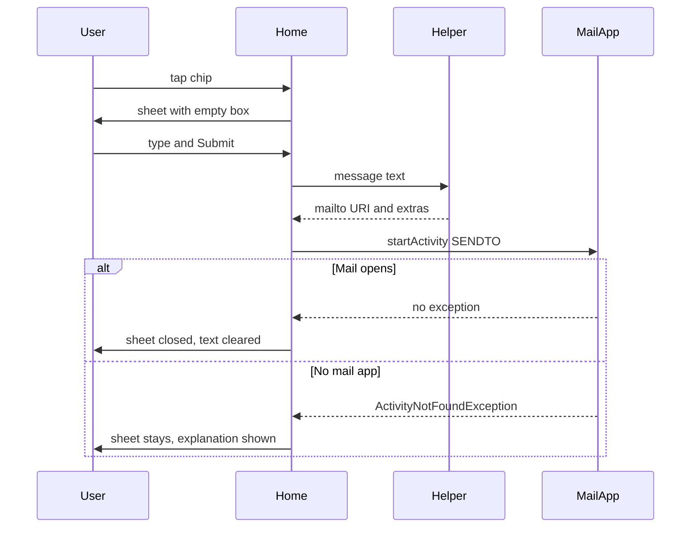

# In-app feedback - Plan

## Goal Capsule

- **Objective:** A Rhetorica user can send the developer a private note from Home without hunting for a contact method, and without Rhetorica collecting that note.
- **Means:** Home Scaffold FAB chip, ModalBottomSheet compose, `ACTION_SENDTO` mailto handoff (KTD1, KTD2, KTD3).
- **Product authority:** This Product Contract. Offline-first and "no personal data collected" in `App_Plan.md` and `PlayStore_Release_Plan.md` constrain the send path.
- **Execution profile:** Standard. Three units. UI-local on Home. No Room, Hilt, or network stack.
- **Tail ownership:** Implementer verifies locally with unit tests and a debug install. No Play Console or hosted-policy change in this work.
- **Stop conditions:** R1–R9 and AE1–AE4 hold on a debug build. `.\gradlew test` passes. Abandoned-attempt code is gone.
- **Open blockers:** None.
- **Product Contract preservation:** Product Contract unchanged.

---

## Product Contract

### Summary

Home gains a small corner chip that opens a short compose overlay.
The user types a message; Submit opens their mail app with the developer's address, a simple subject, and only what they wrote, then the overlay closes.

### Problem Frame

People already reach the developer by email, Play reviews, and in person.
There is no in-app path, so a store user who does not already know how to find the developer has to leave a public review or give up.
Rhetorica is offline-first and tells users it does not send vocabulary activity to a Rhetorica server, so a built-in inbox would change that privacy story.

### Key Decisions

- Private contact, not a rating funnel (session-settled: user-directed — chosen over a Play rating prompt or bug-only / ideas-only flows: users should reach the developer without a public review). Governs R3.
- Write in Rhetorica, send with the user's mail app (session-settled: user-directed — chosen over submitting inside the app or copy/share: no Rhetorica server for now). Governs R5, R8.
- Home corner chip (session-settled: user-directed — chosen over a Home app-bar icon, a Settings app-bar icon, or a labeled Settings row: discreet but on the daily screen). Governs R1.
- One message box and Submit (session-settled: user-directed — chosen over a type menu or optional type chips: fastest compose). Governs R3.
- Email body is only what they typed (session-settled: user-directed — chosen over auto-including app version or device: they send only their words). Governs R5, R8.
- Submit stays disabled while empty (session-settled: user-directed — chosen over always-tappable Submit or an error message: no blank emails). Governs R4.
- Overlay closes after mail opens (session-settled: user-directed — chosen over leaving the sheet open or remembering the text: the draft lives in the mail app). Governs R6.
- Compose is a Home overlay, not a full-screen page (session-settled: user-approved — chosen over a separate full-screen compose: matches a chip that "pulls up" a panel). Governs R3.
- Privacy copy mentions the mail-app handoff (session-settled: user-approved — chosen over leaving privacy text unchanged: sending is user-initiated, not app collection). Governs R9.
- If mail does not open, keep the overlay and the text. Closing is only for a successful handoff. Governs R7.

### Actors

- A1. App user — anyone with Rhetorica installed who wants to contact the developer.
- A2. User's mail app — receives the filled draft and is the only sender.

### Key Flows

- F1. Send a note
  - **Trigger:** A1 taps the Home corner chip.
  - **Actors:** A1, A2
  - **Steps:** Overlay opens with an empty message box. A1 types. Submit becomes available. A1 taps Submit. A2 opens with developer address, simple subject, and the typed body. Overlay closes.
  - **Outcome:** A1 continues in the mail app. Rhetorica does not keep the note.
  - **Covered by:** R1, R3, R4, R5, R6, R8

- F2. Empty message
  - **Trigger:** A1 opens the overlay and has not typed yet, or clears the box.
  - **Actors:** A1
  - **Steps:** Submit stays disabled. No mail app launches.
  - **Outcome:** No blank email is created.
  - **Covered by:** R4

- F3. Mail app does not open
  - **Trigger:** A1 taps Submit with text, and no mail app takes the draft.
  - **Actors:** A1
  - **Steps:** Overlay stays open with the typed text. A1 is told a mail app could not be opened.
  - **Outcome:** A1 does not lose the note. Rhetorica still has not sent anything.
  - **Covered by:** R7, R8

### Requirements

**Entry**

- R1. A small unlabeled chip sits in the lower corner of Home, above the bottom tabs, and does not appear on Saved, Quiz, Speeches, or Settings.
- R2. The chip is recognizable as a way to send feedback once seen, including for assistive tech, without competing with the feed.

**Compose**

- R3. Tapping the chip opens a Home overlay with a message box and Submit, and no bug/idea type picker.
- R4. Submit stays disabled until the message box has text.

**Send**

- R5. Submit opens the user's mail app with the developer address, a simple subject, and a body that is only the typed message.
- R6. When the mail app opens, the overlay closes and Rhetorica does not keep the typed text.
- R7. If the mail app does not open, the overlay stays with the typed text and the user is told a mail app could not be opened.

**Privacy**

- R8. Rhetorica never takes custody of the message: it does not transmit or store it, and it does not attach version or device data.
- R9. In-app privacy copy states that sending feedback uses the user's mail app, and that Rhetorica does not collect the message.

### Acceptance Examples

- AE1. Empty Submit
  - **Covers:** R4
  - **Given:** The compose overlay is open and the message box is empty.
  - **When:** The user tries to submit.
  - **Then:** Submit does nothing. No mail app opens.

- AE2. Successful handoff
  - **Covers:** R5, R6, R8
  - **Given:** The overlay has a typed message and a mail app is available.
  - **When:** The user taps Submit.
  - **Then:** The mail app opens with the developer address, a simple subject, and a body equal to that message, with no added version or device lines. The overlay is gone. Opening the chip again shows an empty box.

- AE3. No mail app
  - **Covers:** R7, R8
  - **Given:** The overlay has a typed message and no mail app can take it.
  - **When:** The user taps Submit.
  - **Then:** The overlay remains with the same text. The user is told a mail app could not be opened. Rhetorica has not sent the message.

- AE4. Chip is Home-only
  - **Covers:** R1
  - **Given:** The user is on Saved, Quiz, Speeches, or Settings.
  - **When:** They look for the feedback chip.
  - **Then:** It is not there. Returning to Home shows it again.

### Scope Boundaries

**Deferred for later**

- Submitting without leaving Rhetorica (user said "for now" on the mail-app path).
- A Play Store rating prompt.
- Bug / idea / other type categories.
- Auto-attached app version or device details.
- A Settings row or app-bar icon as a second entry.

**Outside this version**

- A Rhetorica server, account, or in-app feedback inbox.
- Storing drafts after a successful mail handoff.
- Showing the chip on tabs other than Home.

### Dependencies / Assumptions

- A developer contact email will be supplied when this is built. Exact address and subject wording are planning details.
- Play Data Safety can stay "no data collected" because Rhetorica only opens the user's mail app and does not receive the message.
- Home-only is enough findability for this version.

### Outstanding Questions

**Resolve Before Planning**

- None.

**Deferred to Planning**

- Exact chip icon, size, and corner (left or right), and how it sits against the Word of the Day card and bottom tabs.
- Overlay chrome, field label, and Submit/cancel copy.
- Developer email storage and subject-line wording.
- How the mail app is launched, and the exact no-mail-app explanation.
- Accessibility name for the unlabeled chip.

### Sources / Research

- `App_Plan.md` — local-first, no backend in MVP.
- `PlayStore_Release_Plan.md` — fully offline; no accounts, analytics, ads, or external network calls in the core app; Data Safety expected as no data collected or shared.
- `app/src/main/AndroidManifest.xml` — no `INTERNET` permission today.
- `app/src/main/java/com/rhetorica/app/feature/home/HomeScreen.kt` — Home app bar already has Search and Settings; Settings is not a bottom tab.
- `app/src/main/res/values/strings.xml` — in-app privacy copy says Rhetorica does not send vocabulary activity to a Rhetorica server.
- No existing contact, mailto, or rate-us surface in app code. Closest adjacent handoff is the Settings gallery picker for widget images.

---

## Planning Contract

### Key Technical Decisions

- KTD1. Launch mail with `ACTION_SENDTO` and a `mailto:` URI, and treat success as `startActivity` not throwing. Catch `ActivityNotFoundException` for R7. Do not use `ACTION_SEND` (sharesheet) or `resolveActivity` as the success check. (how for R5, R7, R8)
- KTD2. Place the chip as Home's `Scaffold` `floatingActionButton` at bottom end. Home is already padded above the app bottom tabs in `RhetoricaApp`, so the FAB stays Home-only and above the bar. (how for R1)
- KTD3. Compose in a Material 3 `ModalBottomSheet`. The repo has no sheet today; Profile's `AlertDialog` is the only modal. A sheet matches the chip that "pulls up" a panel. (how for R3)
- KTD4. Declare a mailto `<queries>` intent in the manifest so API 30+ package visibility does not false-fail R7. This is not `INTERNET` and does not send data. Official docs still require catching `ActivityNotFoundException` on `startActivity`. (how for R7)
- KTD5. Keep overlay state UI-local with `rememberSaveable`. Discard text on successful launch and on dismiss. Do not put feedback in a ViewModel or database. (how for R6, R8)
- KTD6. Put destination address and subject in string resources. Address is `derrick5199@gmail.com` (git committer). Subject is `Rhetorica feedback`. (how for R5)

### High-Level Technical Design

Home owns the chip and sheet. A small pure helper builds the mailto URI and the "has text" gate. The Activity starts the mail intent. Rhetorica never receives the sent message.

### Assumptions

- The git committer address `derrick5199@gmail.com` is the developer inbox for this version.
- Dismissing the sheet without Submit discards the draft.
- The chip shows on every Home state, including loading and empty.
- Whitespace-only text counts as empty for R4.
- Play Data Safety stays "no data collected" because the app only starts a mail intent.

### Implementation constraints

- No `INTERNET` permission.
- No new third-party libraries.
- No Room schema change.
- Dual-update `privacy_body` and `app/src/main/assets/privacy_policy.html`.

### Sequencing

U1 first (helper + tests). U2 depends on U1. U3 can run with U2.

### Risks

- Emulators often have no mail app, so R7 is the path testers will hit first.
- Some mail clients ignore extras if the URI has no `body` query. Put subject and body in the URI and in extras.
- Very long messages can overflow a URI. Keep extras as the full body even if the URI is truncated in a later hardening pass. This version encodes both.

---

## Implementation Units

### U1. Mailto helper and unit tests

- **Goal:** A pure helper can say whether Submit is allowed and can build a mailto payload that is only the typed message.
- **Requirements:** R4, R5, R8. Covers AE1, AE2 payload shape.
- **Dependencies:** None.
- **Files:**
  - create `app/src/main/java/com/rhetorica/app/feature/home/FeedbackMail.kt`
  - create `app/src/test/java/com/rhetorica/app/feature/home/FeedbackMailTest.kt`
- **Approach:**
  1. Mirror `NotificationPermissionGate`: an `object` with no Android UI types if possible. Use `android.net.Uri` only if unit tests can still run on the JVM; otherwise return encoded URI strings and let U2 wrap them in `Uri.parse`.
  2. `hasMessage(text)` is true only when trimmed text is not empty.
  3. Builder takes address, subject, and body. Output URI uses `mailto:address?subject=&body=` with encoding. Do not append version or device.
  4. **Execution note:** Implement the helper test-first.
- **Patterns to follow:** `app/src/main/java/com/rhetorica/app/notification/NotificationPermissionGate.kt` and `NotificationPermissionGateTest.kt`.
- **Test scenarios:**
  - Covers AE1. Blank, empty, and whitespace-only strings return not ready.
  - Covers AE2. A typed body is ready, and the payload contains that body and not a version or device token.
  - Subject and address appear in the payload.
  - Special characters in the body are encoded so the URI stays valid.
- **Verification:** `FeedbackMailTest` passes under `.\gradlew test`.

### U2. Home chip, compose sheet, and mail launch

- **Goal:** Home shows the chip, opens the sheet, and hands off to mail or keeps the sheet on failure.
- **Requirements:** R1, R2, R3, R4, R5, R6, R7, R8. Covers F1, F2, F3, AE1–AE4.
- **Dependencies:** U1.
- **Files:**
  - modify `app/src/main/java/com/rhetorica/app/feature/home/HomeScreen.kt`
  - modify `app/src/main/res/values/strings.xml`
  - modify `app/src/main/AndroidManifest.xml`
- **Approach:**
  1. Add `floatingActionButton` on Home's `Scaffold` only, all Home states. Use an outlined feedback/chat icon. `contentDescription` is Send feedback. No label on the chip.
  2. Tap opens `ModalBottomSheet` with title, `OutlinedTextField`, and Submit. Copy Search's text field. Submit enabled only when `FeedbackMail.hasMessage`.
  3. Submit builds the intent from KTD1 using string resources from KTD6, calls `startActivity`, and on success closes the sheet and clears text. On `ActivityNotFoundException`, leave text and show the no-mail explanation in the sheet.
  4. Dismiss clears text and error. Do not add the chip to `RhetoricaApp` or other tabs.
  5. Apply KTD4 mailto `<queries>` in the manifest in this unit so launch can succeed on API 30+.
- **Patterns to follow:** Home `Scaffold` in `HomeScreen.kt`; outer padding in `RhetoricaApp.kt`; `OutlinedTextField` in `SearchScreen.kt`; `startActivity` in Profile notification settings, plus failure handling this plan adds.
- **Test scenarios:**
  - Covers AE4. Chip lives in Home composable, not `RhetoricaApp`.
  - Covers AE1. Submit is not enabled without text, so launch is not invoked.
  - Covers AE3. A thrown `ActivityNotFoundException` keeps sheet state and sets the error string.
  - Happy path: a successful `startActivity` clears sheet state. Prefer extracting a tiny launch callback so this can be unit-tested without Compose if cheap; otherwise verify by reading the callback wiring and a debug install.
- **Verification:** Chip is only on Home. Sheet compose and Submit match F1–F3 on a device or emulator. Unit tests for helper still pass.

### U3. Privacy copy

- **Goal:** Privacy text states that sending feedback uses the user's mail app and that Rhetorica does not collect the message.
- **Requirements:** R9.
- **Dependencies:** None.
- **Files:**
  - modify `app/src/main/res/values/strings.xml`
  - modify `app/src/main/assets/privacy_policy.html`
- **Approach:** Add one paragraph to both twins. Do not claim Rhetorica transmits feedback. Do not mention version or device.
- **Patterns to follow:** Existing `privacy_body` / HTML paragraph pairing.
- **Test scenarios:**
  - Test expectation: none -- copy-only. Confirm both files contain the mail-app sentence and still say Rhetorica does not collect the message.
- **Verification:** Settings → Privacy Policy shows the new paragraph. HTML asset matches.

---

## Verification Contract

- **Unit tests:** `.\gradlew test` — must include `FeedbackMailTest`.
- **Compile:** `.\gradlew assembleDebug`.
- **Manual:**
  - Home chip visible above bottom tabs on feed and empty/loading Home. Absent on Saved, Quiz, Speeches, Settings.
  - Empty Submit does nothing.
  - With a mail app: Submit opens a draft To the destination, subject `Rhetorica feedback`, body exactly the typed text, then the sheet is gone.
  - Without a mail app: sheet stays, text stays, explanation shows.
  - Privacy Policy includes the mail-app sentence.

---

## Definition of Done

- R1–R9 and AE1–AE4 are true on a debug build.
- U1 tests pass. U2 and U3 files exist as listed. No unused experiment code remains.
- No `INTERNET` permission. No Room migration. No new dependencies.
- Privacy string and HTML stay in sync.
